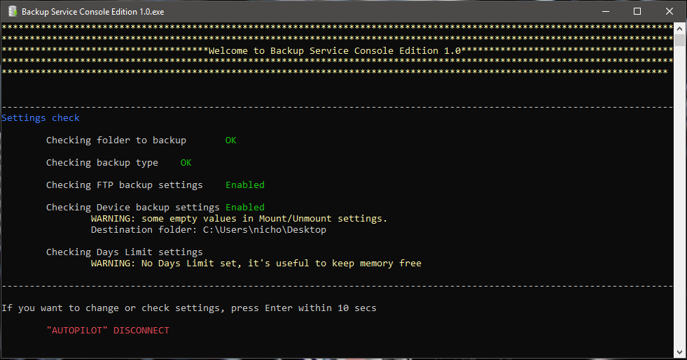
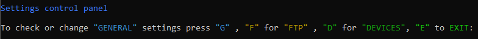
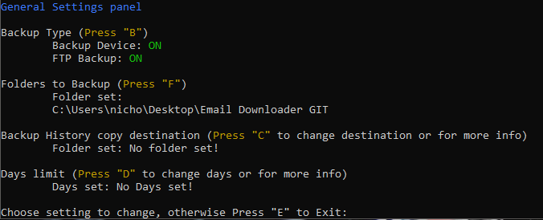
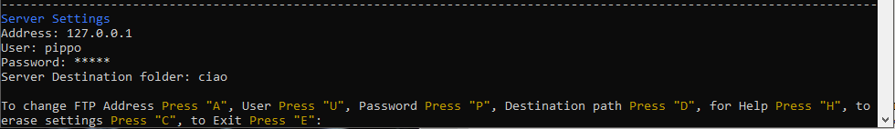
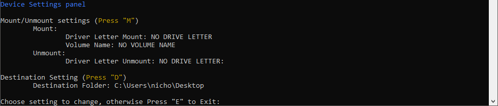

# Backup Service
This was my first project, it was done in 2015, for this reason, is pretty simple. Backup Service is a light and fast software to backup your files on PC and copy them on an external device or upload to an FTP server. The app doesn't have a GUI, user must enter settings from cmd window.

# User Guide
This guide will help user to use the app.

## Installation
User must extract **Backup Service Console Edition 1.0.zip** in C: folder. To run the app user needs to click on .exe shortcut.

## Settings Check

When a user start the app, a panel with settings info will be shown. Here user can check preferences previously chosen. If settings are set, the app will start backup in 10 seconds. User must press enter before backup starts if wants to change settings.

## Settings Control Panel

Once user pressed Enter, a warning sound will advise user that **autopilot** feature has been deactivated. Here user can manage 3 "General", "FTP" and "Devices" settings. User must type the letter of settings and press enter.

## General Settings
Here user can manage principal settings of application.

**Backup Type**

User can turn on/off "Backup Device" or "FTP" server.

**Folder to Backup**

User must add one or more folder path to backup.

**Backup History copy destination**

User can add a path where the app will copy backup record history. This is useful if user wants to access backup history from a cloud folder.

**Days limit**

User can set a day limit. This limit will be used by app to delete older backup. This feature is useful to keep bakcup folder memory low.

## Server Settings
Here user can set connection settings and remote destination folder.

## Device Settings
In this section user can manage device settings.

**Destination Setting**

User must set destination path where backup file will be stored. It can be in local disk or external device.

**Mount/Unmount settings**

If an external device path was set, user can decide if Backup Service will automatically unmount and mount the device, this feature could be useful in case of cyber attack. To do so, user must set Driver letter and Volume name.

## Auto backup
Backup Service is not provided with an autostart feature, but user can take advantage of **Autopilot**. Since the app will automatically start the backup, a user can set by Windows Task Scheduler. After 10 seconds from app startup the backup will begin.
